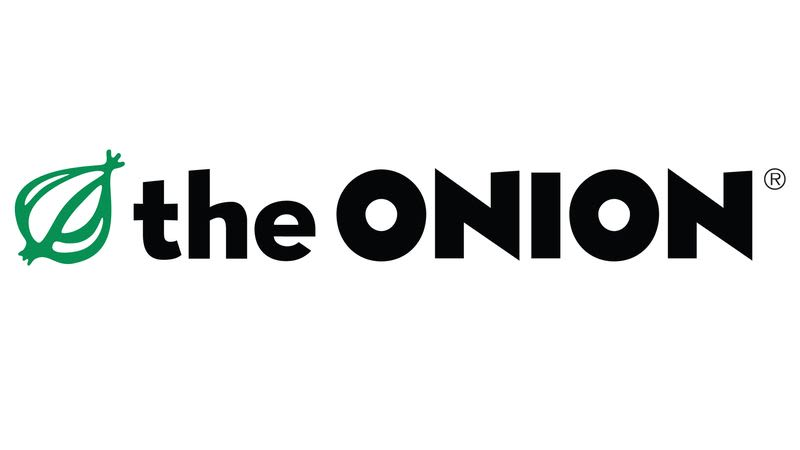

# Mongo Headlines

## Click [here](https://pacific-fortress-37824.herokuapp.com/) to see!

Mongo Headlines is a web scraping website that gets articles from https://www.theonion.com/

Connects to MongoDB database. 
Pressing "Scrape the Onion" gets the current articles from the site. 
You can save articles and comment on articles as well.

## Npm Packages
* axios
* body-parser
* cheerio
* express
* moment
* mongoose
* morgan

## Authors

* **Leeland Clenista**